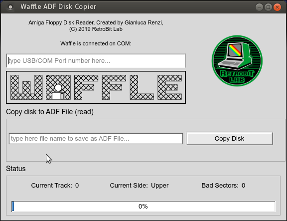
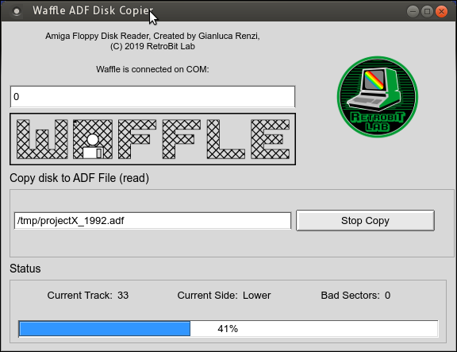
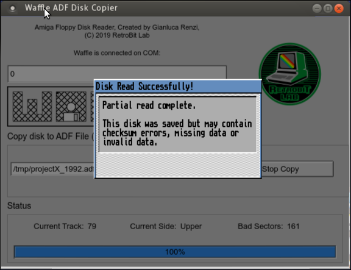
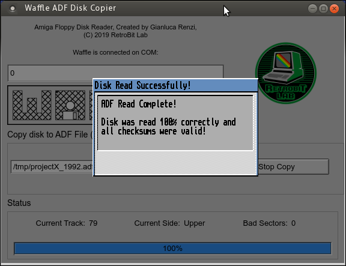

# AVR Amiga Floppy Reader
Created by Gianluca Renzi (C) 2019
E-Mail:
<icjtqr@gmail.com>

<gianlucarenzi@eurek.it>

# What is it?
It is a Qt Gui to the AVR Floppy Disk Reader. It's not a writer (for now ;-)

# Credits
Thanks to Robert Smith <rob@robsmithdev.co.uk> for his initial support and some images of the Windows version

Thanks to John Tsiombikas <nuclear@member.fsf.org> for AVR porting instead of Arduino

Thanks to Qt Library to be (almost) cross platform. ;-)

# Screenshots

# Whats changed?
V1.0 Initial release

# Licence
This entire project is available under the GNU General Public License v3 licence.
See licence.txt for more details.
