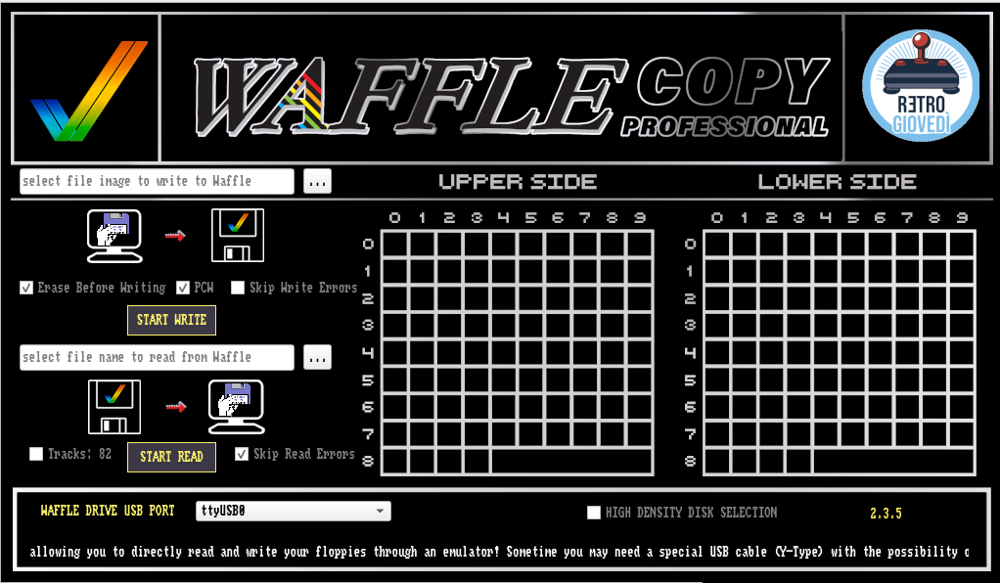
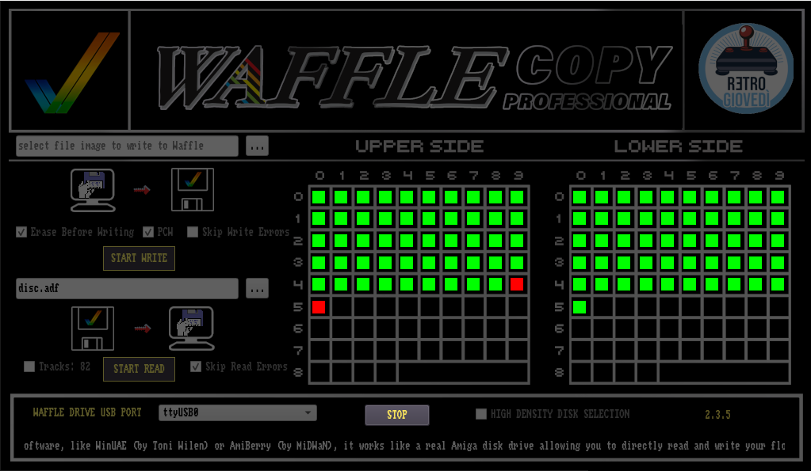

# WaffleCopyPRO-Universal

WaffleCopyPRO-Universal è un potente strumento cross-platform per la lettura e la scrittura di floppy disk, progettato principalmente per i sistemi Amiga. Permette agli utenti di leggere e scrivere immagini di floppy disk Amiga (ADF, IPF, ecc.) utilizzando comuni lettori di floppy per PC e interfacce hardware personalizzate come il Waffle o il DrawBridge.

Questo progetto mira a fornire una soluzione completa e facile da usare per gli appassionati di Amiga, per preservare e utilizzare le loro collezioni di floppy disk su vari sistemi operativi.

## Novità

Questa versione di WaffleCopyPRO-Universal introduce importanti miglioramenti:

*   **Libreria CAPS Image Compilata Staticamente**: La libreria CAPS Image per il supporto al formato IPF è ora compilata staticamente su tutte le architetture supportate (Windows, macOS, Linux). Questo semplifica notevolmente la distribuzione e l'installazione, eliminando la necessità di gestire dipendenze dinamiche.
*   **Supporto Cross-Platform Completo**: Il software è veramente universale e funziona in modo nativo su:
    *   **Windows**
    *   **macOS** (sia su architetture Intel x86_64 che Apple Silicon)
    *   **Linux**
*   **Ampio Supporto Multilingua**: L'interfaccia è tradotta in 16 lingue per una migliore accessibilità globale.
*   **Compatibilità Hardware Estesa**: WaffleCopyPRO-Universal è compatibile con diversi dispositivi hardware:
    *   **Waffle di RetroGiovedì**: Progettato per funzionare al meglio con il [Waffle di RetroGiovedì](https://github.com/gianlucarenzi/waffle).
    *   **DrawBridge di Rob Smith**: Pieno supporto per le varie versioni del progetto [DrawBridge di Rob Smith](http://amiga.robsmith.com/).

## Table of Contents

*   [Features](#features)
*   [Screenshots](#screenshots)
*   [Multi-platform Support](#multi-platform-support)
*   [Installation Guide](#installation-guide)
    *   [Common Prerequisites](#common-prerequisites)
    *   [Linux](#linux)
    *   [macOS](#macos)
    *   [Windows](#windows)
*   [Usage Guide](#usage-guide)
    *   [Connecting Hardware](#connecting-hardware)
    *   [Main Interface Overview](#main-interface-overview)
    *   [Reading a Floppy Disk](#reading-a-floppy-disk)
    *   [Writing a Floppy Disk](#writing-a-floppy-disk)
    *   [Other Features](#other-features)
*   [How It Works: A Glimpse into the Code](#how-it-works-a-glimpse-into-the-code)
*   [Open Source & Customization](#open-source--customization)

## Features

*   **Universal Compatibility**: Works seamlessly with WAFFLE, or other various floppy drive interfaces, including DrawBridge and Arduino-based solutions.
*   **Multi-platform Support**: Natively supported on Linux, macOS (x86_64 and Apple Silicon), and Windows.
*   **Multi-language Support**: Available in 16 languages - English, Italian, German, Spanish, Portuguese, French, Polish, Greek, Hungarian, Russian, Ukrainian, Japanese, Simplified Chinese, Romanian, Serbian/Croatian, and Czech. Language can be changed via the menu bar (File → Language).
*   **Intuitive GUI**: A user-friendly graphical interface built with Qt, allowing for easy operation.
*   **Open Source**: Fully open-source, enabling community contributions, customizations, and extensions.
*   **Advanced Imaging**: Supports various Amiga disk formats for accurate preservation and restoration.

## Screenshots

Here are a couple of screenshots demonstrating WaffleCopyPRO-Universal in action:

### Startup Screen



### Working Screen



## Multi-platform Support

WaffleCopyPRO-Universal is built with cross-platform compatibility in mind, ensuring a consistent experience across different operating systems:

*   **Linux**: Fully supported, leveraging standard serial port communication.
*   **macOS**: Compatible with both Intel (x86_64) and Apple Silicon architectures, utilizing macOS-specific serial port handling.
*   **Windows**: Comprehensive support for Windows operating systems, including FTDI and standard COM port enumeration.

## Installation Guide

This guide will walk you through setting up WaffleCopyPRO-Universal on your system.

### Common Prerequisites

Before you begin, ensure you have the following installed:

*   **Git**: For cloning the repository.
*   **C++ Compiler**:
    *   Linux: `g++` (usually part of `build-essential`)
    *   macOS: Xcode Command Line Tools (`clang`)
    *   Windows: Visual Studio with C++ development tools (e.g., Visual Studio 2019)
*   **Qt 5.15.2**: The application is built using Qt 5.15.2. It is highly recommended to use this specific version. You can download the Qt Online Installer from the [Qt website](https://www.qt.io/download). During installation, make sure to select Qt 5.15.2 for your specific compiler (e.g., `Desktop Qt 5.15.2 MSVC 2019 64-bit` for Windows).

### Linux

1.  **Clone the repository**:
    ```bash
    git clone https://github.com/your-username/ArduinoFloppyDiskReader.git
    cd ArduinoFloppyDiskReader/waffleCopyPRO-Universal
    ```
2.  **Install dependencies**:
    You'll need Qt5 development libraries, `libmikmod`, `libftdi`, and `libqt5serialport`.
    For Debian/Ubuntu-based systems:
    ```bash
    sudo apt update
    sudo apt install build-essential qt5-default qtbase5-dev libqt5serialport5-dev libmikmod-dev libftdi1-dev
    ```
    *Textual indication: After running the command, you should see output indicating packages being downloaded and installed, followed by a successful completion message.*
3.  **Build the application**:
    ```bash
    qmake
    make
    ```
    *Textual indication: The console output will show `qmake` generating the Makefile, followed by `make` compiling source files. Expect to see progress indicators and ultimately a message about the successful build of the application executable.*
4.  **Run the application**:
    ```bash
    ./waffleCopyPRO-Universal
    ```

### macOS

1.  **Clone the repository**:
    ```bash
    git clone https://github.com/your-username/ArduinoFloppyDiskReader.git
    cd ArduinoFloppyDiskReader/waffleCopyPRO-Universal
    ```
2.  **Install Homebrew (if you don't have it)**:
    ```bash
    /bin/bash -c "$(curl -fsSL https://raw.githubusercontent.com/Homebrew/install/HEAD/install.sh)"
    ```
3.  **Install dependencies**:
    You'll need Qt 5.15.2 and `libmikmod`. We recommend using the Qt Online Installer for Qt.
    ```bash
    brew install libmikmod
    # If using a specific Qt version not in your PATH, you might need to source its qmake
    # For example, if Qt is installed in ~/Qt/5.15.2/clang_64/bin
    # export PATH=~/Qt/5.15.2/clang_64/bin:$PATH
    ```
    *Textual indication: The terminal will display messages indicating `brew` downloading and installing `libmikmod`. If successful, it will confirm the installation.*
4.  **Build the application**:
    ```bash
    qmake
    make
    macdeployqt waffleCopyPRO-Universal.app # To package the application and its dependencies
    ```
    *Textual indication: Console output will show `qmake` generating the Makefile, `make` compiling source files, and `macdeployqt` bundling the application into an `.app` package. Success will be indicated by completion messages for each step.*
5.  **Run the application**:
    Open the generated `.app` bundle from Finder or via the terminal:
    ```bash
    open waffleCopyPRO-Universal.app
    ```

### Windows

1.  **Clone the repository**:
    ```bash
    git clone https://github.com/your-username/ArduinoFloppyDiskReader.git
    cd ArduinoFloppyPRO-Universal
    ```
2.  **Install Visual Studio**:
    Install [Visual Studio 2019](https://visualstudio.microsoft.com/vs/older-versions/) (Community Edition is usually sufficient) with "Desktop development with C++" workload.
    *Textual indication: During Visual Studio installation, ensure the "Desktop development with C++" workload is selected in the installer's component list. This workload includes essential C++ compilers and tools.*
3.  **Install Qt 5.15.2**:
    Use the [Qt Online Installer](https://www.qt.io/download). Select "Qt 5.15.2" and ensure you pick the kit matching your Visual Studio version (e.g., `MSVC 2019 64-bit`).
    *Textual indication: In the Qt Online Installer, navigate to the "Select Components" section. Under "Qt," expand "Qt 5.15.2" and check the box for the kit matching your Visual Studio version (e.g., "MSVC 2019 64-bit").*
4.  **Install vcpkg and dependencies**:
    ```cmd
    git clone --branch 2025.12.12 https://github.com/microsoft/vcpkg.git
    .\vcpkg\bootstrap-vcpkg.bat
    .\vcpkg\vcpkg install libmikmod:x64-windows
    ```
    *Textual indication: The PowerShell/Command Prompt will show output from `git clone`, `bootstrap-vcpkg.bat`, and `vcpkg install`. For `vcpkg install`, expect messages about acquiring and building `libmikmod` for `x64-windows`, culminating in a successful installation confirmation.*
5.  **Build the application**:
    Open a "x64 Native Tools Command Prompt for VS 2019" (or similar, depending on your VS version). Navigate to the `waffleCopyPRO-Universal` directory.
    ```cmd
    qmake -tp vc waffleCopyPRO-Universal.pro
    msbuild waffleCopyPRO-Universal.vcxproj /p:Configuration=Release
    ```
    *Textual indication: In the Visual Studio Command Prompt, `qmake` will generate the `vcxproj` file. `msbuild` will then compile the project, showing progress and eventually a "Build succeeded" message.*
6.  **Deploy and Package**:
    The build process creates an executable. You'll likely need to deploy the Qt and vcpkg DLLs.
    Navigate to the `Release` folder within the `waffleCopyPRO-Universal` directory in your project's build output (e.g., `waffleCopyPRO-Universal\Release`).
    Run `windeployqt.exe` (located in your Qt installation, e.g., `C:\Qt\5.15.2\msvc2019_64\bin\windeployqt.exe`) on your executable to copy necessary Qt DLLs. Then manually copy `libmikmod.dll` from `vcpkg\installed\x64-windows\bin` to the same Release folder.
    *Textual indication: Navigate to the `Release` folder (e.g., `waffleCopyPRO-Universal\Release`) in your file explorer. You should see `waffleCopyPRO-Universal.exe` along with various Qt DLLs copied by `windeployqt.exe` and `libmikmod.dll` that you manually copied.*
7.  **Run the application**:
    Double-click `waffleCopyPRO-Universal.exe` in the `Release` folder.

## Usage Guide

This section provides a basic guide on how to use WaffleCopyPRO-Universal.

### Connecting Hardware

WaffleCopyPRO-Universal requires a compatible floppy drive controller (like a Waffle, DrawBridge, or an Arduino-based solution) connected to your PC. Ensure your device is properly connected and recognized by your operating system. You may need to install specific drivers for your chosen interface (e.g., FTDI drivers for some DrawBridge clones, or Arduino IDE drivers for Arduino-based solutions).

### Main Interface Overview

Upon launching WaffleCopyPRO-Universal, you will be presented with the main application window.


*   **Menu Bar**: At the top, you'll find the menu bar with:
    *   **File**: Contains "Language" (to change the application language) and "Quit" options
    *   **Help**: Contains "About" information
*   **Serial Port Selection**: Typically found at the top, allowing you to select the serial (COM) port your floppy controller is connected to.
*   **Disk Operations Tabs**: Separate tabs or buttons for "Read Disk", "Write Disk", "Format Disk", "Diagnostics", etc.
*   **Status Area**: Displays current operation status, progress, and any messages.

#### Changing Language

To change the application language:
1.  Click on **File** → **Language** in the menu bar
2.  Select your preferred language from the list
3.  Click **OK** on the confirmation dialog
4.  The application will close automatically
5.  Restart the application to use the new language

All interface elements, error messages, and diagnostic information will be displayed in your selected language.

### Reading a Floppy Disk

1.  **Select the Serial Port**: Choose the correct serial port connected to your floppy controller from the dropdown menu.
2.  **Insert Floppy Disk**: Place the Amiga floppy disk you wish to read into your floppy drive.
3.  **Navigate to "Read Disk"**: Click on the "Read Disk" tab or button.
    *Textual indication: The application's main window typically features a series of tabs or buttons across the top or side. Locate and click on the one labeled "Read Disk". Within this section, you'll find options for selecting an output file path for the `.adf` image and a prominent "Start" or "Read" button.*
4.  **Choose Output File**: Specify where you want to save the `.adf` (Amiga Disk File) image.
5.  **Start Reading**: Click the "Start" or "Read" button.
    *Textual indication: Once "Start" is clicked, the interface will display a progress bar, typically showing the percentage of tracks read, along with status messages (e.g., "Reading track 0", "Reading track 1", etc.). This bar will incrementally fill as the operation proceeds.*
6.  **Completion**: Once the reading process is complete, a message will confirm success.
    *Textual indication: Upon successful completion, the progress bar will disappear or show 100%, and a clear message, such as "Read Complete!" or "Disk Image Saved Successfully," will appear in the status area or a pop-up dialog.*

### Writing a Floppy Disk

**Warning**: Writing to a floppy disk will overwrite its existing contents. Ensure you have backed up any important data.

1.  **Select the Serial Port**: Choose the correct serial port connected to your floppy controller.
2.  **Insert Target Floppy Disk**: Place the floppy disk you want to write to into your floppy drive. This disk should be formatted or blank, or one you are willing to overwrite.
3.  **Navigate to "Write Disk"**: Click on the "Write Disk" tab or button.
    *Textual indication: In the application's main window, similar to reading, locate and click on the tab or button labeled "Write Disk". This section will present options to select the `.adf` file you wish to write and a "Start" or "Write" button to initiate the process.*
4.  **Choose Input File**: Select the `.adf` (or other supported image format) file you wish to write to the disk.
5.  **Start Writing**: Click the "Start" or "Write" button.
    *Textual indication: After clicking "Start," a progress bar will be displayed, indicating the percentage of data written to the disk. Status messages like "Writing track X" will update as the operation progresses.*
6.  **Completion**: A confirmation message will appear once the writing is finished.
    *Textual indication: Once the writing process is finished, the progress bar will indicate 100% completion, and a confirmation message, such as "Write Complete!" or "Disk Image Written Successfully," will appear in the status area or a pop-up.*

### Other Features

*   **Diagnostics**: Use the "Diagnostics" section to test your hardware connection and identify potential issues.
    *Textual indication: Accessing the "Diagnostics" section (often a dedicated tab or menu item) will reveal options for testing the connection to your floppy controller, performing various hardware checks, and viewing real-time data from the device.*
*   **Settings**: Application settings are managed internally using Qt's `QSettings` class. `QSettings` provides a platform-independent way to store and retrieve application settings, typically saved in configuration files (e.g., INI files on Windows, plist files on macOS, or XDG configuration files on Linux) or the system registry. The language preference is automatically saved and restored when you restart the application. Other settings for various parameters like rotational speed, track count, or specific hardware interface options can be configured through menu options or dialogs.

## How It Works: A Glimpse into the Code

The core functionality of WaffleCopyPRO-Universal involves low-level serial communication to interact with floppy drive controllers. Below is a simplified snippet from `lib/SerialIO.cpp` demonstrating how the application opens a serial port, handling platform-specific differences:

```cpp
// Open a port by name
SerialIO::Response SerialIO::openPort(const std::wstring& portName) {
	closePort();

#ifdef FTDI_D2XX_AVAILABLE
	// ... FTDI specific code ...
#endif

#ifdef _WIN32
	std::wstring path = L"\\.\\" + portName;
	m_portHandle = CreateFileW(path.c_str(), GENERIC_READ | GENERIC_WRITE, 0, NULL, OPEN_EXISTING, 0, 0);
	if (m_portHandle == INVALID_HANDLE_VALUE) {
		switch (GetLastError()) {
		case ERROR_FILE_NOT_FOUND:  return Response::rNotFound;
		case ERROR_ACCESS_DENIED:   return Response::rInUse;
		default: return Response::rUnknownError;
		}
	}
	updateTimeouts();
	return Response::rOK;
#else
	std::string apath;
	quickw2a(portName, apath);
#ifdef __APPLE__
	m_portHandle = open(apath.c_str(), O_RDWR | O_NOCTTY | O_NDELAY);
#else
	m_portHandle = open(apath.c_str(), O_RDWR | O_NOCTTY);
#endif
	if (m_portHandle == -1) {
		switch (errno) {
		case ENOENT: return Response::rNotFound;
		case EBUSY: return Response::rInUse;
		default: return Response::rUnknownError;
		}
	}

	// ... Linux/macOS specific code for locking and configuring port ...

	updateTimeouts();
	return Response::rOK;
#endif

	return Response::rNotImplemented;
}
```
This snippet illustrates the use of preprocessor directives (`#ifdef`, `#else`) to adapt the code for different operating systems (Windows, macOS, Linux) and specific hardware interfaces (FTDI). This modular approach ensures broad compatibility and efficient hardware interaction.

## Open Source & Customization

WaffleCopyPRO-Universal is an open-source project, licensed under the Mozilla Public License Version 2.0 and GNU General Public License, version 2 or later. This means:

*   **Full Transparency**: The entire codebase is available for review, understanding, and modification.
*   **Community Driven**: We encourage contributions from the community to improve features, fix bugs, and extend functionality.
*   **GUI Customization**: The graphical user interface, built with Qt, can be customized to your liking. Feel free to modify `mainwindow.ui` and related C++ files (`mainwindow.cpp`, `mainwindow.h`) to tailor the look and feel.
*   **Code Extensibility**: Developers are welcome to dive into the core logic, add support for new hardware, implement new disk formats, or optimize existing routines.

Join us in making WaffleCopyPRO-Universal the ultimate tool for Amiga floppy disk management!
